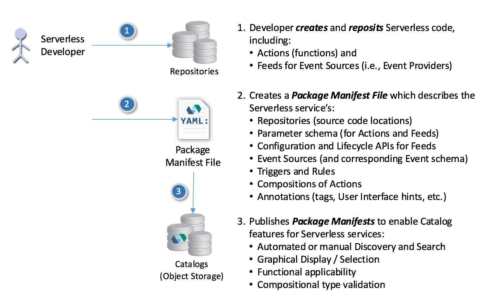

# OpenWhisk Packaging Specification v0.8.3

Updated: 2017-02-02

Current version (link):  [openwhisk_v0.8.3.pdf](https://github.com/openwhisk/openwhisk-wskdeploy/raw/master/specification/openwhisk_v0.8.3.pdf)

## Purpose

This specification defines two file artifacts, along with YAML schema, that are used to describe OpenWhisk Packages for deployment to a target OpenWhisk platform; these are:

*	**Package Manifest file**: Contains the Package definition along with any included Action, Trigger or Rule definitions that comprise the package.  This file includes the schema of input and output data to each entity for validation purposes.
*	**Deployment file**: Contains the values and bindings used configure a Package to a target OpenWhisk platform provider’s environment and supply input parameter values for Packages, Actions and Triggers.  This can include Namespace bindings, security and policy information.

### Note
This specification is under development and in draft status; therefore, it is subject to change during this development period.  We are posting this draft seeking review, comment, suggestions from the OpenWhisk and greater Serverless community including areas such as: model description and semantics, schema and grammar (YAML), end-user readability, concept explanations, use cases completeness, etc.  In general, mthe goal is to make the document a top-quality means to describe a complete OpenWhisk package without having to understand and API.  In addition, we welcome submission of new use cases or variant use cases that may challenge the current schema and be the subject for discussion and new features.

## Contents

The specification includes the following general sections:

* Introduction
* Programming model
  * OpenWhisk Entities, Composition, Namespacing, Cardinality
* Package Processing
* Definitions
* References
* Specification
  * Types, Schema and Artifacts
* Scenarios and Use cases
  * Usage Scenarios
  * Schema use cases
    * e.g., Hello world (variants), Basic Trigger and Rule, GitHub Feed, etc.
* Event sources
  * Curated Feeds, Public Sources
* Other Considerations
  * Tooling Interaction, Simplification of WebHook Integration, Enablement of Debugging and DevOps
  
## Formats

Once the draft progresses further (i.e., known outstanding "high priority" design issues have been addressed), we will make the document available in markdown.  At this time the following formats are provided for review:

* PDF: [openwhisk_v0.8.pdf](openwhisk_v0.8.pdf)

---

### Conceptual Manifest and Deployment file usage

The following images outline the basic process for creating and using both Manifest and Deployment files against a typical developer workstream:

#### Conceptual Manifest file creation

#### Conceptual Manifest file deployment

